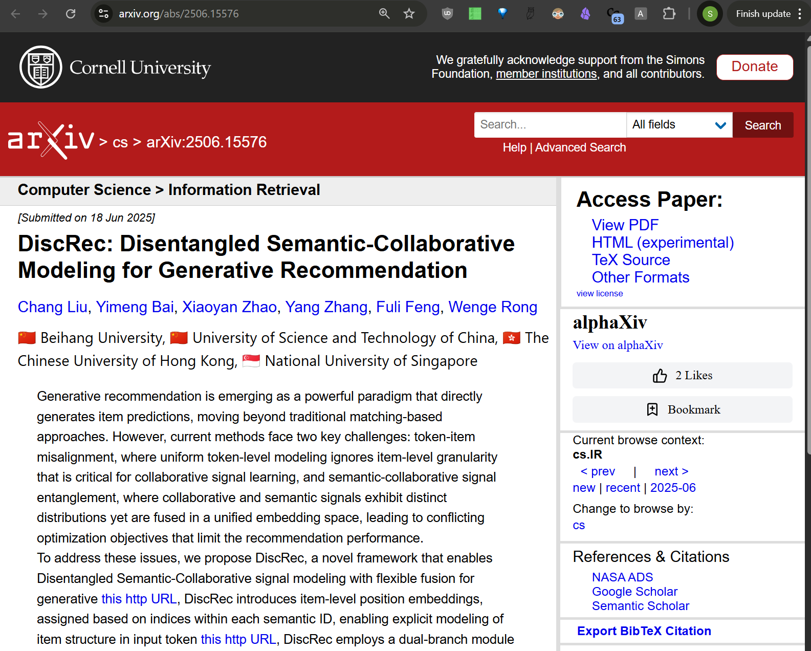

# arxiv-affiliations

This project extracts and processes author affiliation data from arXiv papers. It downloads PDF version of the paper when you visit /abs or /new or /recent pages and runs the first page of the paper through Gemini 2.5 Flash lite asking for a list of affiliations (if they are found on that page, some papers have affiliations tucked elsewhere) and also tries to guess the country of the organization (no always successfully).

Be careful opening huge lists of papers: it will download all of them one by one, making it hard both for your computer and for arxiv. PRs improving that stuff welcome.

## Features

- Download and parse arXiv PDF files
- Extract author names and affiliations
- Insert affiliations and country flags below author list in /abs, /new and /recent pages on GitHub
- Caches affiliations for seen/visited papers, so it doesn't reprocess them unnecessary
- Have some indication of progress

## Screenshots




## Usage

1. Clone the repository:

    ```bash
    git clone https://github.com/yourusername/arxiv-affiliations.git
    ```

2. Load the extension into Chrome:
    - Open Chrome and go to `chrome://extensions/`
    - Enable "Developer mode" (top right)
    - Click "Load unpacked"
    - Select the extension's directory (where the manifest file is located)

3. Obtain a Gemini API key:
    - Go to [Google AI Studio](https://aistudio.google.com/app/apikey).
    - Sign in with your Google account.
    - Click "Create API key" and copy the generated key.

4. Add your Gemini API key in the extension:
    - Open the extension's Options page (right-click the extension icon > "Options" or via Chrome Extensions page).
    - Paste your Gemini API key into the designated field and save.

5. Update your list of organizations of interest:
    - In the Options page, find the section for "Organizations of Interest".
    - Enter word stems (e.g., `mit`, `stanford`, `oxford`)—these will be used as regex patterns to highlight matching affiliations.
    - Optionally, set a custom prompt for Gemini to use when extracting affiliations.
    - Save your changes.

6. Free Gemini key is good for 15 RPM and 500 request per day, if you need more pay Google some (minuscule) amount of money and get a paid key. Flash Lite costs $0.4 per million tokens which is, idk, about 1000 papers to process.

## Warning

Vibe-coded randomly in one weekend without any intention to support or enhance, use at your own risk. Contribute any features you’d like to see, or fork/use as inspiration. Or, just visit [alphaxiv](https://alphaxiv.org) for a more polished experience, they are great and have affiliations extracted for all papers and you can sort, follow orgs and otherwise enjoy that info.

## License

See [LICENSE](LICENSE) for details.
